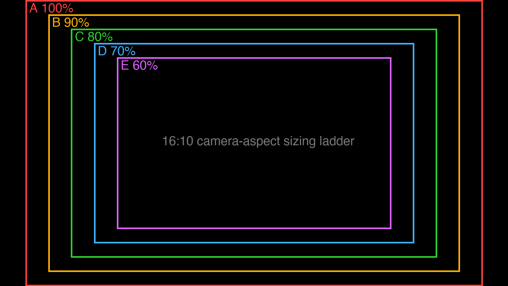

# HIL setup & calibration (S8 bite E)

OWNER: **Nick**. The rig: Monterey stills/clips play on the bench LCD
(driven by the Pi, rendered by `hil-lcd.service` — pygame on KMS, **never
a browser**, see Traps); both OpenMV cameras watch the screen; the
harness steps stills, decodes raw YOLOX heads host-side, and scores
against Nick's labels through a per-camera homography.

## Standing hardware rules

- **Shielded USB cables ONLY on the camera boards.** An unshielded N6
  cable + the LCD's HDMI EMI = board USB death within ~1–30 NPU
  predicts, presenting as firmware crashes (2026-08-25, ~12 reproductions
  before the cable was spotted; SPEC §Open questions has the trail).
- Cameras and screen must not move after calibration — a nudge
  invalidates the homography, not just the aim. Re-run from step 3.
- The still set under `~/hil_monterey/stills/` is FROZEN once labeled —
  the manifest order is what the scorer keys on.

## 1. Bring the screen up

Start the **Urchin HIL — Monterey playback** recipe on
`http://nereus000:8088` (it owns :8091 and locks both boards).
`hil-lcd.service` finds it and lights the LCD automatically. Screen
dark? `systemctl status hil-lcd` on the Pi — it waits until :8091
answers.

## 2. Aim the cameras with the sizing ladder

Stop the HIL demo; start playback **ad-hoc** (the aiming demo needs the
board locks, but the screen must keep rendering):

```bash
ssh pi@nereus000 'cd ~/ADIN_SPI_OpenMV && setsid nohup python3 pi/hil/playback_server.py >/tmp/hil_playback.log 2>&1 </dev/null &'
```

Start the **Camera aiming view** card (`:8090`, both cameras live, no
models — runs on any bench state). Put the ladder on the screen:

```bash
curl -X POST http://nereus000:8091/api/set -H 'Content-Type: application/json' -d '{"mode":"boxes"}'
```



The nested boxes are **16:10 — the cameras' native VGA aspect** (the
content is 16:9; A=100% is the largest 16:10 fit). Move each camera
until the **largest box that fits fully in BOTH views** just fills the
frame. Tighter box = more pixels per urchin = more accuracy headroom
(px-on-target is the currency; the T2 floor is ~24–32 px). 2026-08-25
pick: **D (70%)**.

## 3. Pin the calibration markers to the chosen box

`MARKERS` in `pi/hil/playback_server.py` are marker CENTERS as content
fractions — set them to the chosen box's corners. For box scale `s`:
x = 0.5 ± 0.45·s, y = 0.5 ± 0.5·s (order TL, TR, BR, BL):

| box | markers |
|---|---|
| C 80% | `[(0.14, 0.10), (0.86, 0.10), (0.86, 0.90), (0.14, 0.90)]` |
| D 70% | `[(0.185, 0.15), (0.815, 0.15), (0.815, 0.85), (0.185, 0.85)]` |
| E 60% | `[(0.23, 0.20), (0.77, 0.20), (0.77, 0.80), (0.23, 0.80)]` |

Deploy the edit to the Pi, restart the ad-hoc server, then verify:
`{"mode":"calib"}` — **all four white squares must be inside each
camera's view** on :8090. The harness reads markers from `/api/state`,
so page, LCD, and solver can never disagree.

Scoring consequence (already handled in the harness): at a sub-100% box
the cameras see only part of each still, so the scorer filters ground
truth to what is actually visible in-frame — expect GT counts per still
to drop accordingly. That is correct, not a bug.

## 4. Run the scored pass

Stop the aiming demo, restart the HIL recipe (wait out the 35 s
settle), then:

```bash
ssh pi@nereus000 "cd ~/ADIN_SPI_OpenMV && python3 -u pi/hil/hil_harness.py \
  --board 'AE3=/dev/serial/by-id/usb-OpenMV_OpenMV_Camera_0829c14000000000-if00' \
  --board 'N6=/dev/serial/by-id/usb-MicroPython_Pyboard_Virtual_Comm_Port_in_FS_Mode_020023000450433547373200-if00' \
  --phases nano-whole,nano-tiled,tiny-whole,tiny-tiled \
  --out ~/hil_runs/<run-name>"
```

One serial attach per board runs everything (bite-R discipline); the
INA3221 power log runs automatically. Success artifacts — trust these,
not the exit code:

- `homography solved; markers at (…)` per board, + `calib_<board>_markers.jpg`
  (red circles ON the four squares)
- `rows.jsonl` (one row per scored frame), `power_*.jsonl`
- `overlays/` — green = labels, yellow = detections mapped back onto the
  source stills; the yellow boxes must sit ON urchins

`FAIL: calibration marker not visible in quadrant …` means aim or a
dark screen — the saved `calib_<board>.jpg` shows what the camera saw.

## Traps (each cost real time on 2026-08-25)

- **Never put a browser/kiosk on the Pi's display while boards run.**
  chromium-under-cage coincided with board USB instability all night
  (later attributed to the N6 cable, but the pygame client is also just
  lighter and boring). `hil-lcd.service` is the only sanctioned renderer.
- One demo at a time: the aiming card and the HIL recipe both want the
  board locks — hence the ad-hoc playback trick in step 2.
- `pkill -f playback_server` from an ssh one-liner kills the ssh
  session itself (pattern matches its own command line) — use
  `pkill -f 'playback_serve[r]'`.
- mpremote/harness attaches on a freshly crash-reset board die sterile
  once; the harness retries automatically — by hand, just try again.
