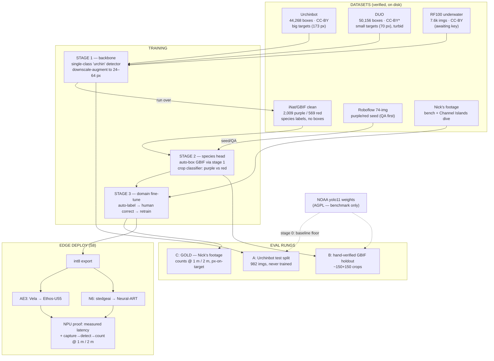

# Urchin training-corpus plan (S26 bite 3 — **APPROVED by Nick 2026-08-22**)

Drafted 2026-08-21; all four open decisions approved 2026-08-22 (see
§Decisions). Fills in the 4-step strategy from
`docs/urchin_datasets.md` with the numbers verified in S26 bites 1–2.
Slots marked **[bite 2]** are measured before this plan is finalized.
Verbatim license captures: `ml/urchin_data/licenses/`. Data:
`~/nereus_ml/datasets/`.

## Posture (Nick, 2026-08-21)

The urchin detector is a **technology demo, not a commercial moat**:
prove the capability, run live demos, and **publish the model for others
to download**. Consequences, recorded so the plan's license calls make
sense:

- **DUO is UNFENCED for training** (recommended; Nick to confirm at
  review). figshare declares CC BY 4.0; the URPC-lineage caveat stays in
  `licenses/duo.md`, but for a freely-published demo model the residual
  risk is a retrain-without-it, not product damage. Attribute in the
  model card.
- AGPL architectures (Ultralytics) become *workable* — open release
  satisfies AGPL — but an **Apache-2.0 family (YOLOX / NanoDet class)
  is still preferred** so people who download the model can embed it in
  closed products without inheriting AGPL. Adoption IS the point.
  Decision at review; must be verified against BOTH board compilers
  (Vela int8 for AE3 Ethos-U55, `stedgeai` for N6 Neural-ART — S8 B1's
  answer) before it is final.
- NC-licensed data (FathomNet, iNat's CC-BY-NC bulk) stays OUT anyway:
  a downloadable model trained on NC data poisons downstream commercial
  use — the friendliness argument cuts the same way as AGPL.

## The corpus (verified numbers, on-disk status 2026-08-21)

| # | Dataset | Role | Volume (verified) | License | On disk |
|---|---|---|---|---|---|
| 1 | Urchinbot | backbone: urchin-ness | 9,872 imgs / 44,268 boxes / 3 spp; box min-side median 173 px, 0% <24 px | CC-BY-4.0 | full pull in progress (~32 GB) |
| 2 | DUO | backbone: turbidity + small targets | 7,782 imgs / 50,156 echinus boxes; median 70 px, p10 34 px | CC BY 4.0 (figshare; lineage caveat) | ✔ complete |
| 3 | iNat/GBIF clean | species head: purple vs red | 2,009 purple / 569 red imgs, image-level | CC0 + CC-BY per record (provenance JSONL kept) | ✔ complete |
| 4 | RF100 underwater | backbone top-up (license-clean URPC volume) | 7,600 imgs / 25,299 urchin boxes verified (+10,270 starfish banked) | CC BY 4.0 (export yaml) | ✔ complete |
| 5 | Roboflow 74-img | hard-case eval (purple-ONLY: 3 red boxes) | 74 imgs / 2,015 purple+red boxes, median 24 px | CC BY 4.0 (export yaml) | ✔ complete |
| 6 | Nick's footage (bench + **Channel Islands dive, ~3 wks out**) | domain fine-tune + GOLD eval | TBD — see shot list | ours | future |
| — | NOAA yolo11n/x weights | step-0 baseline only | n=5.5 MB / x=114 MB | AGPL lineage — never shipped | ✔ complete |

## The five stages

**Stage 0 — Baseline before training [bite 2].** Score NOAA yolo11n and
yolo11x on eval rungs A and B (below). These numbers are the floor every
later stage must beat to justify its cost. If the baseline already
serves the demo, stage 1 shrinks to a fine-tune.

**Stage 1 — Backbone: single-class "urchin" detector.**
Train on Urchinbot + DUO (+ RF100 when exported), all classes collapsed
to `urchin`. Splits: Urchinbot's official train/val/test (7,912/976/982)
respected — its test split is eval rung A and NEVER trains; DUO's
train/test likewise (val is a byte-copy of test — use test once).
Augmentation policy is driven by the measured target-size gap: heavy
downscale augmentation of Urchinbot (median 173 px) into the 24–64 px
band to cover the deployment px regime; DUO already lives there (median
70 px). Label-QA tallies **[bite 2]** decide per-source sampling weights.

**Stage 2 — Species head: purple vs red.**
Run the stage-1 detector over the 2,578 clean GBIF images; boxes above a
confidence threshold inherit the image's species label → crop-classifier
training set for ~free. Filter out out-of-water frames (confirmed
present in-sample). Seed/sanity-check with the Roboflow 74-img set once
its junk classes are QA'd. **Class imbalance 3.5:1 purple:red** —
handle by oversampling red + heavier augmentation (decision at review).
Architecture: two-stage first (detect → classify crop) because that is
what the data shapes force; optional later distillation into a
single-shot two-class detector for the boards.

**Stage 3 — Domain fine-tune: our water, our camera.**
The auto-label-then-correct loop S8 B2 rehearses with balls, pointed at
real footage: run the stage-1/2 model, human-correct, fine-tune.
Sources: BM camera bench/field footage + **Nick's Channel Islands
dive**. NPS KFM archive footage stays a listed reserve (by-request via
the program office) if volume runs short.

*Dive shot list (one page, for the trip):* slow steady passes over
urchin patches at a NEAR and a FAR standoff (~1 m and ~2 m as rough
guides — the goal is to sweep pixels-on-target through and below the
24–32 px floor, not to hit exact distances); a few fixed-count clusters
(know N while filming — that is count ground truth); both species in
one frame wherever reds appear; kelp-canopy light and open-barrens
light; 4K if available, highest bitrate, horizontal, no strobes needed.

**Eval-axis note (S8 relay of Nick, 2026-08-21): distance labels are
NOT a variable** — the two-ball captures' "1 m / 2 m" run names were
all really ~1.5 m, and S8 has dropped distance as an analysis axis.
**Pixels-on-target is the axis** everywhere in this plan; metres appear
only as capture instructions for producing a px sweep.

**Stage 4 — Edge deployment + NPU proof.**
Export int8; compile per board (Vela / `stedgeai`); deploy via the S25
workbench recipe path. Acceptance is S8's hard rule: **measured
per-inference latency consistent with the NPU tables, not "it
inferred"** — a CPU fallback shows up in the number. End-to-end
capture→detect→count rides S8 bite C's harness, swept over
**pixels-on-target** (standoff distance is only the knob that produces
it — see the eval-axis note below).

## Eval design — three rungs, increasing honesty

| Rung | Set | Measures | Status |
|---|---|---|---|
| A | Urchinbot official test split (982 imgs, never trained on) | generic urchin-ness | ready now |
| B | Hand-verified GBIF holdout (~150 purple + ~150 red crops, human-checked) | species accuracy | after stage-2 auto-boxing |
| C | **GOLD: Nick's footage, hand-corrected** — counts swept over pixels-on-target (px logged per measurement) | does it work for US, on-board | after the dive / bench captures |

NOAA baselines get scored on A and B **[bite 2]** so every stage-1/2
result has a floor to beat. Rung C is the only rung that counts for the
demo story; A and B exist so we never confuse "learned the dataset" with
"works in our water".

## Storage & artifacts

Data stays under `~/nereus_ml/datasets/<source>/` (never the repo).
Merged training views (symlink/manifest-based, no copies) land under
`~/nereus_ml/datasets/corpus_v1/` when stage 1 starts. Every training
run: config + git-sha + data-manifest hash recorded under
`~/nereus_ml/runs/`. The repo gets: this plan, manifests, license
captures, model cards, and eval-result tables.

## Decisions (ALL APPROVED — Nick, 2026-08-22)

1. **DUO unfenced for training.** figshare CC BY 4.0 declaration accepted
   under the demo/open-release posture; lineage caveat stays on record;
   attribute in the model card.
2. **Architecture: Apache-2.0 family (YOLOX/NanoDet class), gated on a
   compiler check** — one candidate must compile through BOTH Vela (AE3)
   and stedgeai (N6) before stage 1 trains. If no Apache candidate
   passes and an Ultralytics one does, AGPL is accepted and documented.
   The compiler check is the FIRST task of the follow-on session.
3. **Red imbalance: oversample + heavier augmentation now**; Nick's dive
   footage is the targeted collection pass if rung B shows red recall
   lagging.
4. **S8 bite E re-scoped: train-compile-measure only.** Corpus + labels
   are delivered (labels.jsonl, agreed convention); bite E starts with
   board-compiled baseline scoring, then stage-1 training. No dataset
   work remains in bite E. (Relayed to the S8 session 2026-08-22.)

**Capture plan addendum (Nick, 2026-08-22): the dive runs GoPro 4K AND
the AE3 dive rig together** — paired same-scene passes per the shot list
(sync marker each sequence). Consequence: stage 3 gets true AE3-domain
footage plus its 4K twin (the sensor-gap measurement), and rung C can be
built per-camera. The rig itself is board-touching work owned by the S8
arc (TRACKER flagged item, ~3-week deadline); GoPro-only remains the
fallback if the rig slips — the dive is not gated on it.

## [bite 2] results (filled 2026-08-21; details in dossier §Bite-2 QA)

- **NOAA load-and-run: PASS** (both models, 1-class `urchin`, Mac).
  Qualitative floor: fine on big clear urchins, **0 detections in
  turbid/small-target frames, 3–6 of 142 on CA barrens** — the custom
  model is justified by measurement. Full rung-A mAP pending the
  Urchinbot pull finishing.
- **QA tallies**: Urchinbot 24/30 strong · DUO 7 crisp + 18 plausible
  (noisy; 1 real label error found; YOLO ids remapped —
  0=starfish 1=holothurian 2=echinus 3=scallop) · RF100 DUO-like ·
  74-img consistent with its 24 px median.
- **GBIF QA changes stage 2's shape**: species fidelity is excellent
  (29/30, 26/30) but **~70–75% of purple images are out-of-water** —
  fine for the crop classifier, wrong for detector fine-tuning; the
  auto-box pass must filter hands / dry scenes / dead tests / museum
  specimens / larvae.
- **Roboflow exports done**: RF100 7,600/52,684 exact (10,270 starfish
  banked for the iceboxed sun-star detector); 74-img is purple-ONLY
  (3 red boxes) → moved from "species seed" to hard-case eval; red
  seeding now rides GBIF + Nick's Channel Islands dive footage.
- Urchinbot full pull COMPLETE + verified (9,872/9,872, 34.8 GiB, zero
  corrupt). **Rung-A FULL (983 imgs): yolo11n mAP50=0.243
  mAP50-95=0.090 P=0.466 R=0.245; yolo11x completing (provisional
  0.334/0.131/0.702/0.313 at n=690) — vs Urchinbot's published 0.908
  ceiling on this data.** Still open: yolo11x FULL line (running),
  rung-B (after stage-2 auto-boxing), underwater auto-filter
  implementation (follow-on session).

## Flow (same diagram lives in the chat as a rendered file)

\* DUO: figshare-declared CC BY 4.0, lineage caveat on record.
